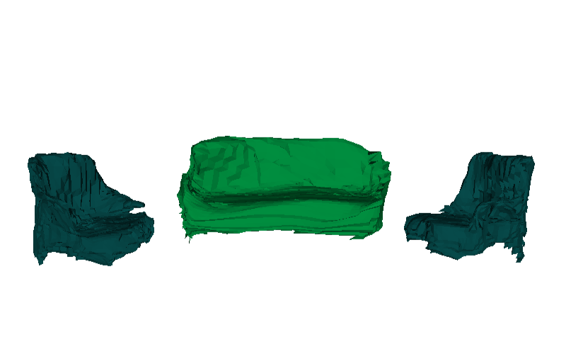

# Mesh R-CNN with Sheared Decoder
### Advanced Deep Learning for Computer Vision - Visual Computing

We propose a novel non-learnable Shearing Layer, that can lift 2D feature maps to 3D feature maps in a computationally efficient manner, without the need for backprojection. We have implemented the same on top of the <a href="https://github.com/facebookresearch/meshrcnn" target="_blank">Mesh-RCNN code base.</a>





## Installation Requirements
- [Detectron2][d2]
- [PyTorch3D][py3d]

The implementation of Mesh R-CNN is based on [Detectron2][d2] and [PyTorch3D][py3d].
You will first need to install those in order to be able to run Mesh R-CNN.

To install
```
git clone https://github.com/facebookresearch/meshrcnn.git
cd meshrcnn && pip install -e .
```

## Demo

Run Mesh R-CNN with Sheared Decoder on an input image

```
python demo/demo.py \
--config-file configs/pix3d/meshrcnn_R50_FPN.yaml \
--input /path/to/image \
--output output_demo \
--onlyhighest MODEL.WEIGHTS meshrcnn://meshrcnn_R50.pth
```

See [demo.py](demo/demo.py) for more details.

## Running Experiments

### Pix3D
See [INSTRUCTIONS_PIX3D.md](INSTRUCTIONS_PIX3D.md) for more instructions.

